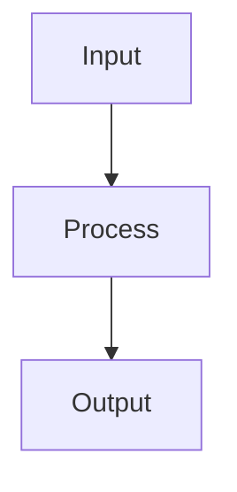

# Contributing to Smarter Agents

Thank you for contributing! This document provides guidelines for adding rules, skills, and other content to the toolkit.

## Quick Start

1. Fork the repository
2. Create a feature branch: `git checkout -b feat/my-new-rule`
3. Make your changes
4. Run linting and tests: `make lint && make test`
5. Submit a PR

## Rule Authoring Guide

### Rule Structure

Each rule is a Markdown file in `rules/` with YAML frontmatter:

```markdown
---
applyTo: '**'
description: 'One-line summary of what this rule enforces'
---

# Rule: Descriptive Name

## Core Principle

One paragraph explaining the fundamental concept.

---

## Requirements

### 1. Specific Requirement

- **Target**: Measurable target
- **Why**: Rationale
- **Action**: Concrete steps

---

## References

- **related-rule**: How it connects
- **skill-name**: Skill that implements this
```

### Frontmatter Fields

| Field | Required | Description |
|-------|----------|-------------|
| `applyTo` | Yes | Glob pattern for files this rule applies to (usually `**`) |
| `description` | Yes | One-line summary shown in rule listings |

### Style Guidelines

- Use imperative language ("Do X", not "You should do X")
- Include concrete examples (✅ Compliant / ❌ Non-Compliant)
- Link to related rules and skills
- Target ≤ 300 lines per file
- Use Diátaxis structure: Tutorial / How-To / Reference / Explanation

### Example Template

```markdown
---
applyTo: '**'
description: 'Brief summary of the rule'
---

# Rule: Name in Title Case

## Core Principle

One paragraph explaining the "why".

---

## Requirements

### 1. First Requirement

- **Target**: Specific, measurable outcome
- **Why**: Rationale connecting to agent failure modes
- **Action**: Concrete implementation steps

### 2. Second Requirement

...

---

## Anti-Patterns vs. Safe Practices

| Anti-Pattern | Risk | Safe Practice |
| :--- | :--- | :--- |
| Bad thing | What goes wrong | Good alternative |

---

## Examples

### ❌ Non-Compliant

```python
# Bad example
```

### ✅ Compliant

```python
# Good example
```

---

## References

- **rule-name**: Brief relationship
- **skill-name**: Brief relationship

## Skill Authoring Guide

### Skill Structure

Each skill lives in its own directory under `skills/`:

```text
skills/my-skill/
├── SKILL.md           # Main documentation (required)
├── scripts/           # Optional executable scripts
│   └── my_script.py
├── templates/         # Optional template files
│   └── template.yaml
└── schemas/           # Optional JSON schemas
    └── schema.json

```

### SKILL.md Format

```markdown
---
name: my-skill
description: 'One-line summary of what this skill does'
---

# Skill Name 🛠️

Brief description of purpose and use cases.

---

## When to Use

- Scenario 1
- Scenario 2

---

## Quick Commands

```bash
# Example usage
python skills/my-skill/scripts/my_script.py --arg value
```

---

## Detailed Usage

### Subcommand 1

Description and arguments.

### Subcommand 2

...

---

## Configuration

Any configuration options or environment variables.

---

## Examples



---

## Related Rules

- **rule-name**: How this skill enforces or relates to the rule

### Skill Frontmatter Fields

| Field | Required | Description |
|-------|----------|-------------|
| `name` | Yes | Unique identifier (kebab-case) |
| `description` | Yes | One-line summary |

### Script Guidelines

- Use `#!/usr/bin/env python3` shebang
- Include type hints
- Follow existing code style (ruff, ty)
- Add CLI with argparse
- Handle errors gracefully with clear messages

### Template Guidelines

- Use `.template.json` or `.template.md` suffix
- Include placeholder comments
- Validate with JSON schema if applicable

## Adding to Collections

After creating a rule or skill, update `collections.yaml`:

```yaml
collections:
  - name: "smarter-agents-core"
    rules:
      - "rules/my-new-rule.md"
    skills:
      - "skills/my-skill"
```

Rules and skills can also be added to `rules-only` or `skills-only` collections.

## Updating Documentation

1. Update `README.md` Repository Structure section
2. Update `docs/` if adding significant new concepts
3. Run `make lint` to validate sync

## Linting & Testing

```bash
# Run all linters
make lint

# Run tests
make test

# Run specific test file
python -m pytest tests/unit/test_installer.py -v
```

## PR Checklist

- [ ] Rule/skill follows authoring guide
- [ ] Frontmatter is complete
- [ ] Added to `collections.yaml`
- [ ] Added to `README.md` structure
- [ ] `make lint` passes
- [ ] `make test` passes
- [ ] `python scripts/validate_sync.py` passes
- [ ] PR description explains the problem solved

## Code Style

- **Python**: ruff + ty (configured in `pyproject.toml`)
- **Markdown**: pymarkdownlnt (`.pymarkdown.json`)
- **YAML**: yamllint + yamlfmt (`.yamllint.yaml`)
- **JSON**: json.tool + check-jsonschema
- **Shell**: actionlint for workflows

## Dialect

Default to **South African English (en-ZA)** for documentation
and comments. See `rules/communication-formatting.md` for dialect
hierarchy.

## Questions?

Open an issue or start a discussion. We're happy to help!
