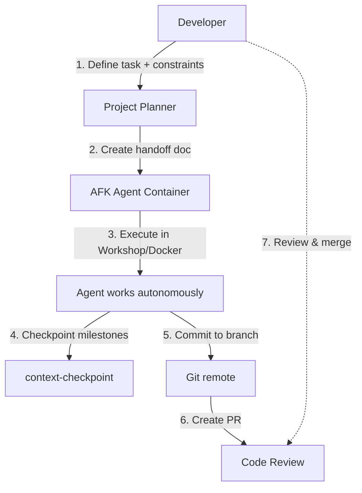

# Pattern: AFK Loops (Containerized Agent Handoff)

## Concept

**AFK Loop** = Hand a task to an AI agent and let it work autonomously while you're **A**way **F**rom **K**eyboard. The agent runs in a containerized environment, makes commits to a branch, and you review results when you return.

> "The hand-off occurs while you're not even close to a computer." — Blog post author

---

## Why AFK Loops?

| Problem | AFK Solution |
|---------|--------------|
| Long-running tasks block your session | Agent runs in background container |
| Context limits in single session | Fresh container = fresh context |
| Need to review before merge | Commits land on branch for PR review |
| Want to parallelize work | Spawn multiple containers |

---

## Typical Architecture



---

## Tools in This Space

| Tool | Language | Sandbox | Status | Notes |
|------|----------|---------|--------|-------|
| **taboo** | Go | Workshop | Internal (Canonical) | Workflows → commits to branch |
| **Workshop** | — | Workshop | Internal (Canonical) | Sandbox environment |
| **Sandcastle** | — | Custom | Research | Inspiration for taboo |
| **claude-code in Docker** | — | Docker | Ad-hoc | Common DIY approach |
| **zenflow** | — | — | — | To research |
| **agent-go** | Go | — | — | To research |

---

## AFK Loop Workflow

### 1. Plan & Grill (Pre-flight)
```bash
# Use project-planner persona to decompose task
# Use grilling skill to stress-test plan
grilling --plan "Implement user authentication"
```

### 2. Create Handoff Document
```bash
# Compact context for fresh agent
handoff --task "Implement JWT auth with refresh tokens"
# Outputs: /tmp/handoff-<uuid>.md
```

### 3. Launch Containerized Agent
```bash
# Option A: taboo (if available)
taboo run --handoff /tmp/handoff-xyz.md --repo myorg/myproject --branch afk/auth

# Option B: Workshop directly
workshop run --agent opencode --config .opencode/agents/afk-agent.json \
  --repo myorg/myproject --branch afk/auth

# Option C: Docker + claude-code
docker run -v $(pwd):/workspace \
  -e GITHUB_TOKEN=$GITHUB_TOKEN \
  myorg/claude-code:latest \
  --branch afk/auth --handoff /workspace/handoff.md
```

### 4. Agent Executes Autonomously
- Reads handoff doc as initial context
- Uses `afk-agent` persona (context-checkpoint, test-driven-verification)
- Checkpoints at each milestone (`context-checkpoint` skill)
- Runs tests, self-verifies, commits

### 5. Results Land on Branch
```bash
# Agent pushes to feature branch
git push origin afk/auth
# Creates PR automatically or manually
gh pr create --title "AFK: Implement JWT auth" --body-file /tmp/pr-body.md
```

### 6. Review & Merge
- Developer reviews PR when convenient
- `code-reviewer` persona runs diff-audit
- Merge or request changes

---

## Integration with smarter-agents

### Personas
| Persona | Role in AFK Loop |
|---------|------------------|
| `project-planner` | Decomposes goal, creates handoff doc |
| `afk-agent` | Executes in container (primary) |
| `code-reviewer` | Reviews resulting PR |
| `security-auditor` | Scans for secrets in AFK commits |

### Skills
| Skill | Use in AFK Loop |
|-------|-----------------|
| `context-checkpoint` | Serialize state at milestones |
| `handoff` | Compact conversation for fresh agent |
| `grilling` | Stress-test plan before launch |
| `diff-auditor` | Verify PR quality before merge |

### Rules Enforced
- `test-driven-verification` — Agent must TDD, self-verify
- `scoped-autonomy` — No scope creep in autonomous work
- `goal-anchor` — Re-anchor on original goal after compaction
- `context-paranoia` — Keep context lean in long sessions

---

## Container Requirements

```dockerfile
# Minimal AFK agent container
FROM ubuntu:24.04
# Install: opencode, git, gh, language runtimes
# Copy: .opencode/agents/afk-agent.json, rules/, skills/
# Entrypoint: opencode --agent afk-agent --handoff $HANDOFF_FILE
```

### Must Have
- Git + GitHub CLI (`gh`)
- Agent harness (opencode, claude-code, etc.)
- smarter-agents rules/skills installed
- Network access to GitHub
- Write access to target repo (via token)

---

## Best Practices

### 1. Small, Verifiable Milestones
- Each checkpoint = passing tests + clean diff-audit
- Agent fails fast if milestone criteria not met

### 2. Explicit Constraints in Handoff
```markdown
## Non-Negotiable Constraints
- No new dependencies without approval
- Must pass `make lint && make test`
- No modifications to `auth/` legacy module
- Max 500 lines changed per milestone
```

### 3. Failure Handling
- Agent checkpoints *before* risky operations
- On failure: restore checkpoint, try alternative approach
- Max 3 retries per milestone, then escalate in PR

### 4. Security
- Never bake secrets into container image
- Inject `GITHUB_TOKEN` at runtime
- `security-auditor` scans PR before merge

### 5. Observability
- Container logs → structured JSON → Loki/Elastic
- Checkpoint state → visible in PR description
- `headroom savings` / `rtk gain` for token tracking

---

## Comparison: AFK vs Interactive

| Aspect | Interactive | AFK Loop |
|--------|-------------|----------|
| Context management | Manual (rewind, compact) | Automatic (fresh container) |
| Session length | Limited (~120k tokens) | Unlimited (checkpointed) |
| Parallelism | One task at a time | Multiple containers |
| Review timing | Immediate | Async (when you return) |
| Debugging | Live | Post-hoc via logs/PR |
| Best for | Exploration, quick fixes | Features, refactors, migrations |

---

## Getting Started

1. **Install smarter-agents** with `afk-agent` persona:
   ```bash
   python3 installer.py ~/.config/opencode --harness opencode --copy
   ```

2. **Create handoff doc** using `project-planner` + `grilling` skill

3. **Launch** via your preferred container method

4. **Review PR** when you return

---

## References

- [context-checkpoint skill](../skills/context-checkpoint/SKILL.md)
- [agent-architecture rule](../rules/agent-architecture.md)
- [context-paranoia rule](../rules/context-paranoia.md)
- [taboo documentation](../tools/taboo.md) (internal)
- Blog post: "Lessons from building taboo" (source of pattern)

---

**AFK loops turn "I'll do it later" into "it's done when I get back."**
