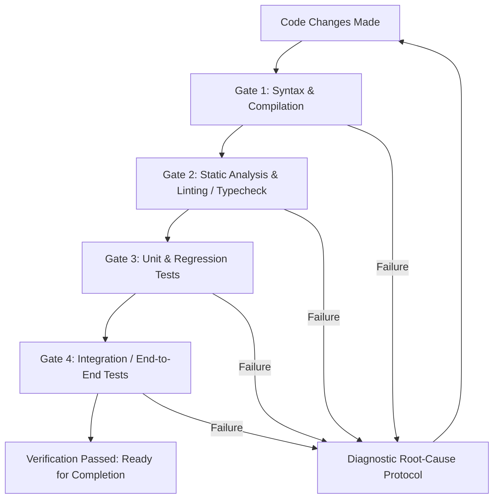

# Test-Driven Verification: Zero Unverified Code & Anti-Tampering

> **Directive**: Never declare a task complete, propose a patch, or conclude execution without fresh, deterministic verification evidence. Never weaken, bypass, or delete tests or assertions to force a passing build.

---

## 1. Core Principles

### 1.1 Zero Unverified Code
- **Assumption is the root of regression**: Never assume code compiles, runs, or passes linting simply because changes appear straightforward.
- **Fresh verification required**: Verification commands (compilation, typechecks, linter, tests) must be executed *after* the final edit and before declaring work done.
- **Evidence-based reporting**: Every task completion summary must include concrete proof of execution (commands run, exit codes, test outcomes).

### 1.2 Strict Test Anti-Tampering
- **Existing tests are the specification**: Existing test suites define expected behavior and invariant contracts.
- **Prohibition on weakening assertions**:
  - NEVER delete failing tests or assertions simply to make the test suite pass.
  - NEVER weaken assertions (e.g. changing `assert result == expected` to `assert result is not None`, or removing edge-case assertions) without explicit user authorization or architectural requirement.
  - NEVER mark failing tests as `@skip`, `@ignore`, `xfail`, or comment them out to bypass failures.
  - NEVER introduce mock objects or dummy returns in production code or test fixtures solely to mask unhandled exceptions or unimplemented functionality.
- **Permissible test modifications**:
  - Updating tests is strictly allowed *only* when the task explicitly mandates changing the interface, requirements, or behavior.
  - When test updates are required, the rationale and behavioral delta must be explicitly documented in the change summary.

---

## 2. Mandatory Verification Gates

Before presenting changes or completing a turn, execute the relevant verification gates in hierarchical order:



### Gate 1: Syntax & Compilation
- Ensure the project builds or compiles cleanly with zero syntax or compiler errors.
- Examples: `cargo check`, `tsc --noEmit`, `go build ./...`, `python3 -m py_compile ...`

### Gate 2: Static Analysis, Formatting & Typechecks
- Run the repository's configured linters and static type checkers.
- Zero new lint warnings or type errors should be introduced by the patch.
- Examples: `ruff check`, `mypy`, `golangci-lint run`, `eslint`, `cargo clippy`

### Gate 3: Unit & Targeted Regression Tests
- Run unit tests relevant to modified modules first for rapid feedback.
- Execute full test suites when feasible to detect collateral regressions.
- Examples: `pytest tests/test_module.py`, `npm test -- path/to/test.spec.ts`, `cargo test`

### Gate 4: Clean Environment / Build Artifact Verification
- Verify that untracked temporary files, cache artifacts, or uncommitted debug code are cleaned up before completion.

---

## 3. Diagnostic Root-Cause Protocol on Test Failures

When a test, lint, or build fails, follow this disciplined diagnostic loop. DO NOT blindly modify code or introduce random trial-and-error mutations.

```
+-------------------------------------------------------------+
| 1. OBSERVE & ISOLATE                                        |
|    - Read exact stack trace, error message, and line number |
|    - Identify inputs, expected outputs, and actual values   |
+-------------------------------------------------------------+
                              |
                              v
+-------------------------------------------------------------+
| 2. HYPOTHESIZE & ROOT-CAUSE                                 |
|    - Formulate a clear hypothesis explaining the failure    |
|    - Distinguish between implementation bug vs. requirement |
+-------------------------------------------------------------+
                              |
                              v
+-------------------------------------------------------------+
| 3. MINIMAL SURGICAL FIX                                     |
|    - Apply the most focused fix addressing the root cause   |
|    - Avoid sweeping refactors or unrelated changes          |
+-------------------------------------------------------------+
                              |
                              v
+-------------------------------------------------------------+
| 4. RE-VERIFY & EXPAND                                       |
|    - Re-run the failing test to confirm resolution          |
|    - Re-run full test suite to guarantee zero regressions   |
+-------------------------------------------------------------+
```

### Diagnostic Guidelines:
1. **Analyze the Trace**: Always inspect the earliest origin of the error in the stack trace, not just the final assertion failure.
2. **Reproduce First (TDD)**: When fixing a reported bug, write or run a reproducing test *before* editing production code to verify the test fails for the expected reason.
3. **No Brittle Hacks**: Do not add ad-hoc `try/catch: pass` blocks, arbitrary type casts (`as any`), or unconditional `None` checks without understanding why the value was invalid.

---

## 4. Test Expansion & Coverage Standards

When adding new features or fixing bugs:

1. **Bug Fixes Require Regression Tests**:
   - Every bug fix must be accompanied by a regression test case covering the exact input, edge condition, or boundary state that caused the defect.
2. **New Features Require Complete Coverage**:
   - Happy path / standard execution.
   - Boundary values (empty inputs, zero, max limits, null/nil handling).
   - Error states, malformed inputs, and expected exceptions.
3. **Deterministic & Isolated**:
   - Tests must be deterministic and free of race conditions, hardcoded timing dependencies (`sleep(5)`), or order-dependent state.
   - Use mock servers, temporary directories, or dependency injection for external resources.

---

## 5. Verification Checklist for Agents

Before completing any coding task, verify against this checklist:

- [ ] Has the code been compiled / checked for syntax errors?
- [ ] Have type checks and linters passed cleanly?
- [ ] Have targeted unit tests for modified components executed and passed?
- [ ] Have all existing test assertions remained intact without unauthorized weakening?
- [ ] For bug fixes, does a regression test reproduce the fix deterministically?
- [ ] Are verification command outputs and test tallies presented in the final response?
