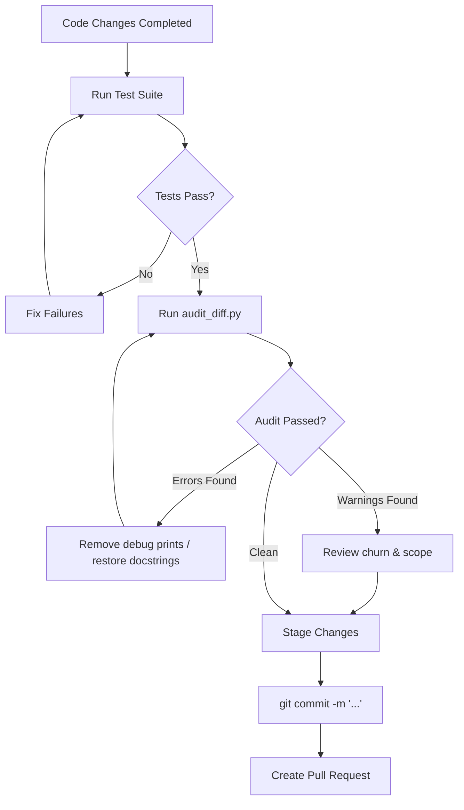

# Diff Auditor: Boundary & Semantic Change Inspector 🔍

`diff-auditor` is an essential agent verification skill designed to catch common agent mistakes before changes are committed, pushed, or submitted for code review.

Modern AI coding agents frequently suffer from subtle change regressions:
- **Stripping existing docstrings or inline comments** during refactoring.
- **Leaving stray debug statements** (`print()`, `console.log()`, `debugger`, `pdb.set_trace()`, `fmt.Println()`).
- **Modifying files outside the task scope** (e.g. unintended configuration edits, lockfiles, temporary files).
- **Excessive line churn / whole-file rewrites** where modifying 5 lines turns into 500 lines replaced.
- **Accidental staging of sensitive secrets** (`.env`, `.pem`, credentials).

---

## 🎯 When to Use This Skill

Activate or run `diff-auditor`:
1. **Before Staging and Committing**: Check working tree changes (`git diff`) to verify only intended modifications were made.
2. **Before Creating a Pull Request**: Check staged changes (`git diff --cached`) or branch differences (`git diff main...HEAD`).
3. **During Code Reviews & Subagent Audits**: Verify that subagent contributions stayed strictly within their assigned boundaries.

---

## 🛠️ Automated Verification Script

This skill includes an automated CLI audit script: [`skills/diff-auditor/scripts/audit_diff.py`](scripts/audit_diff.py).

### Quick Commands

```bash
# 1. Audit unstaged working tree changes
python3 skills/diff-auditor/scripts/audit_diff.py

# 2. Audit staged changes ready for commit
python3 skills/diff-auditor/scripts/audit_diff.py --staged

# 3. Audit feature branch changes against main
python3 skills/diff-auditor/scripts/audit_diff.py --base main

# 4. Enforce strict scope (only allow modifications in src/ and tests/)
python3 skills/diff-auditor/scripts/audit_diff.py --allowed-scope "^src/" "^tests/"

# 5. Output machine-readable JSON for automated harnesses
python3 skills/diff-auditor/scripts/audit_diff.py --json
```

---

## 📋 Audit Dimensions & Checks

### 1. Docstring and Comment Preservation 📝
- **Rule**: Never strip existing architectural explanations, method docstrings, or inline rationale comments unless explicitly instructed.
- **Detection**: Flags diff deletions that remove multi-line docstrings (`"""`, `'''`), JSDoc (`/** ... */`), or mass comment deletions (`#`, `//`, `///`).
- **Remediation**: Restore missing documentation blocks using `git checkout -p` or selective line restoration.

### 2. Stray Debug Statements & Breakpoints 🐛
- **Rule**: No temporary debug logs or breakpoint triggers should ever make it into production commits.
- **Detection**:
  - **Python**: `print(...)`, `import pdb`, `pdb.set_trace()`, `breakpoint()`, `ic(...)`
  - **JavaScript / TypeScript**: `console.log(...)`, `console.debug(...)`, `debugger;`
  - **Go**: `fmt.Println(...)`, `fmt.Printf(...)`
  - **Rust**: `println!(...)`, `dbg!(...)`
  - **Ruby**: `puts ...`, `binding.pry`, `binding.irb`
  - **PHP**: `var_dump(...)`, `print_r(...)`, `dd(...)`
- **Remediation**: Remove debug lines or replace with standard project logging facilities at appropriate levels.

### 3. Scope Boundary Enforcement 🎯
- **Rule**: Only files related to the specific task or issue should be modified.
- **Detection**: Checks all modified paths against `--allowed-scope` patterns or sensitive file blacklists (`.env`, `credentials.json`, `*.pem`, `*.key`).
- **Remediation**: Unstage or revert accidental edits with `git checkout -- <file>` or `git restore --staged <file>`.

### 4. Excessive Line Churn & Whole-File Rewrites 📊
- **Rule**: Edits should be surgical. Replacing an entire 500-line file when only a 3-line bug fix was needed indicates brittle file operations.
- **Detection**: Flags individual files where `added + deleted > threshold` (default: 500 lines).
- **Remediation**: Use surgical edit tools (e.g. `replace_file_content` / targeted diff patches) rather than blind file rewrites.

---

## 🔄 Recommended Agent Pre-Commit Workflow



1. **Step 1: Test Verification** — Run unit and integration tests to ensure functional correctness.
2. **Step 2: Diff Audit** — Execute `python3 skills/diff-auditor/scripts/audit_diff.py --base main` to verify boundaries.
3. **Step 3: Correct Violations** — Clean up any flagged debug statements or restored comments.
4. **Step 4: Commit & PR** — Commit with descriptive messages linked to the tracked issue.
